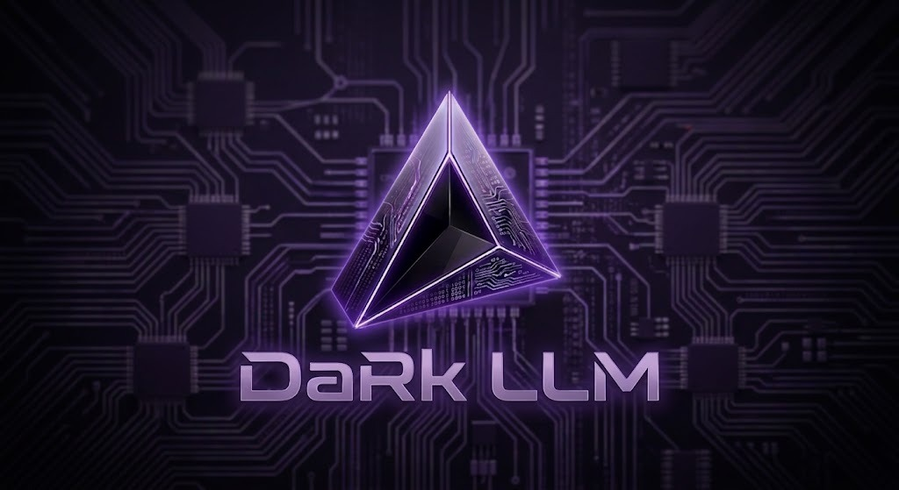

<p align="center">
  
</p>

<p align="center">
  <strong>A premium, zero-configuration local AI studio and offline GUI for LLMs (Chat), Stable Diffusion (Image Generation), Whisper (Speech-to-Text), and Kokoro (Text-to-Speech). Powered by hardware-accelerated GPU and NPU execution on Windows, Linux, and macOS.</strong>
</p>

<p align="center">
  
  
  
</p>

---

## 📖 Table of Contents
* [What is DaRk LLM?](#what-is-dark-llm)
* [Key Features](#key-features)
* [Workspace & Engine Architecture](#workspace-architecture)
* [Supported Models](#supported-models)
* [Folder Architecture](#folder-architecture)
* [Getting Started](#getting-started)
  * [Windows Setup](#windows-setup)
  * [Linux Setup](#linux-setup)
  * [macOS Setup](#macos-setup)
* [Hardware Compatibility & Acceleration](#hardware-compatibility-acceleration)
* [Troubleshooting & FAQ](#troubleshooting-faq)
* [Building From Source](#building-from-source)
* [Licensing](#licensing)

---

## <a id="what-is-dark-llm"></a>📖 What is DaRk LLM?

**DaRk LLM** is a completely offline, zero-setup, self-contained AI studio for Windows, Linux, and macOS. Wrapper in a sleek, obsidian dark glassmorphism theme with neon-purple accent visual design, it runs entirely on your own local hardware with no censorship, tracking, cloud subscriptions, or API keys required.

It unifies four major local AI capabilities into one high-performance desktop interface:
1. **💬 Text Chat (LLMs):** Converse privately with open-source language models (GGUF format) powered by official, high-performance `llama.cpp` backends.
2. **🎨 Image Generation (Stable Diffusion):** Generate and edit high-quality images offline using `.safetensors`, `.gguf`, or `.ckpt` model weights.
3. **🎙️ Speech-to-Text (Whisper):** Transcribe voice recordings and speech to text in real-time with an integrated `whisper.cpp` engine.
4. **🗣️ Text-to-Speech (Kokoro TTS):** Convert text outputs into highly natural, lifelike vocal audio offline using the `Kokoro-82M` ONNX model.

---

## <a id="key-features"></a>🌟 Key Features

*   **100% Offline & Private:** Run inferences locally. No internet, telemetry, cloud logging, or API keys required.
*   **Signature Dark Purple Theme:** Modern glassmorphism dark UI with ambient neon purple glow, sleek typography, and high-tech circuit aesthetics.
*   **Zero-Install Portability:** Entire runtime (Node.js, models, GPU backends) is self-contained. Zero global system environment changes.
*   **Auto-Configured Acceleration:** Auto-detects hardware specs to load CUDA (Nvidia), ROCm (AMD), Vulkan (Intel/AMD/NVIDIA), Metal (macOS), or OpenVINO (Intel NPU) backends.
*   **Integrated Model Manager:** Paste Hugging Face URLs to download weights directly, or drag-and-drop local weights to import them.
*   **Live Performance Monitor:** Track CPU, RAM, GPU, and VRAM utilization in real-time directly inside the web UI.
*   **Local Output Gallery:** Saves generated images side-by-side with prompt parameters and metadata JSON files.

---

## <a id="workspace-architecture"></a>⚙️ Workspace & Engine Architecture

To avoid exhausting system RAM or VRAM, text and image engines are mutually exclusive by default. You can switch between workspaces inside the UI:

*   **Text Chat Workspace:** Uses a portable `llama.cpp` server backend. Model weights (.gguf) are stored in `app/llm-models/`.
*   **Image Generation Workspace:** Uses a dedicated `stable-diffusion.cpp` backend node. Model weights are stored in `app/models/`.
*   **Speech Worker (Whisper):** Runs a localized `whisper-cli` process to convert your vocal input to text.
*   **Audio Output (Kokoro TTS):** Utilizes `kokoro-js` locally on the server side to read responses in natural voices.

---

## <a id="supported-models"></a>Supported Models

The app is designed around single-file local models that can be loaded directly by the bundled backend engines.

### Text, speech, and TTS

| Workspace | Supported model files | Put files in | Notes |
| :--- | :--- | :--- | :--- |
| Text Chat | `.gguf` llama.cpp models | `app/llm-models/` | Use single-file GGUF chat/instruct models. Vision models may also require a matching `mmproj` file. |
| Speech-to-Text | whisper.cpp `.bin` models | `app/speech-models/` | Use Whisper GGML/whisper.cpp model files. |
| Text-to-Speech | Kokoro `.json` manifests and model assets | `app/tts-models/` / `app/tts-runtime/` | Use the built-in Kokoro setup and Model Manager entries. |

### Image generation

| Model type | Supported | Put files in | Notes |
| :--- | :--- | :--- | :--- |
| Stable Diffusion 1.5 checkpoints | Yes | `app/models/` | Best compatibility. Use `.safetensors` or `.ckpt` files. |
| SDXL checkpoints | Yes | `app/models/` | Supported as single-file checkpoints. Requires more RAM/VRAM than SD 1.5. |
| Single-file SD/SDXL GGUF checkpoints | Limited | `app/models/` | Only complete single-file checkpoints are supported. |
| OpenVINO image model folders | Intel NPU only | `app/openvino-models/` | Download from the Model Manager after running the OpenVINO setup. |
| CoreML image models | Apple Silicon only | `app/models/` | Requires macOS on Apple Silicon and the CoreML setup path. |

Known-good image models available from the Model Manager:

| Name | Filename | Type | Approx. size | Recommended use |
| :--- | :--- | :--- | :--- | :--- |
| Juggernaut XL v9 Lightning | `Juggernaut_RunDiffusionPhoto2_Lightning_4Steps.safetensors` | SDXL | 6.6 GB | High-quality photorealism on mid/high tier machines. |
| DreamShaper XL Lightning | `DreamShaperXL_Lightning.safetensors` | SDXL | 6.6 GB | General SDXL images, fantasy, renders, and illustration. |
| DreamShaper 8 | `DreamShaper_8_pruned.safetensors` | SD 1.5 | 2.1 GB | Faster, lower-memory image generation. |
| CyberRealistic V8 | `CyberRealistic_V8_FP16.safetensors` | SD 1.5 | 2.0 GB | Realistic SD 1.5 images and lower-memory systems. |
| Rev Animated | `rev-animated-v1-2-2.safetensors` | SD 1.5 | 2.0 GB | Stylized/anime SD 1.5 images. |

---

## <a id="folder-architecture"></a>📁 Folder Architecture

```
DaRk-LLM/
├── windows.bat                # Windows Launcher (Double-click entrypoint)
├── linux.sh                   # Linux Launcher (Terminal entrypoint)
├── mac.sh                     # macOS Launcher (Terminal entrypoint)
├── LICENSE                    # MIT Open Source License
├── .gitignore                 # Excludes models and output images from version control
├── README.md                  # Detailed system documentation
├── scripts/
│   ├── setup/                 # Platform setup and backend installers
│   ├── reset/                 # Clean install & environment repair
│   ├── server/                # UI web server and backend lifecycle manager
│   ├── workers/               # Local worker processes
│   ├── build/                 # Optional source build helpers
│   └── config/                # Runtime configuration catalogs
└── app/
    ├── frontend/              # UI source code (Vite + React)
    ├── models/                # Place image weights here (.safetensors, .gguf, .ckpt)
    ├── llm-models/            # Place text GGUF weights here
    └── outputs/               # Saved images and parameters metadata
```

---

## <a id="getting-started"></a>🚀 Getting Started

Ensure you have a modern web browser installed. Follow the quick guide below for your platform:

### Windows Setup

1. **Launch:** Double-click **`windows.bat`**.
   > [!NOTE]
   > On the first run, the script will automatically download a portable Node.js runtime and configure pre-compiled GPU/CPU backend binaries.
2. **Add Models:** Drop `.gguf` text weights into `app/llm-models/` or `.safetensors` image weights into `app/models/` (or download them via the **Model Manager** tab in the UI).
3. **Generate:** Open `http://localhost:1420` in your browser, select your model, and write a prompt.

### Linux Setup

1. **Make executable:** Open a terminal in the project folder and make the script executable:
   ```bash
   chmod +x linux.sh
   ```
2. **Launch:** Run **`./linux.sh`**.
   - **NVIDIA GPU Users:** You will be prompted to set up the high-performance **CUDA** backend.
   - **AMD Radeon Performance:** Run with **`./linux.sh --max-perf`** to add the ROCm backend (~1.3 GB download).
   - **Intel Core Ultra NPU:** Run with **`./linux.sh --setup-openvino`** to configure Intel NPU support.
3. **Add Models:** Drop your weights into `app/llm-models/` or `app/models/`.
4. **Generate:** Open `http://localhost:1420` in your browser.

### macOS Setup

1. **Make executable:** Open a terminal in the project folder and make the script executable:
   ```bash
   chmod +x mac.sh
   ```
2. **Launch:** Run **`./mac.sh`**.
   > [!IMPORTANT]
   > The prebuilt macOS backend is optimized for **Apple Silicon (M1 or newer)** and uses **Metal** GPU acceleration. *(macOS Intel hardware is unsupported)*.
3. **Add Models:** Drop your weights into `app/llm-models/` or `app/models/`.
4. **Generate:** Open `http://localhost:1420` in your browser.

---

## <a id="hardware-compatibility-acceleration"></a>🖥️ Hardware Compatibility & Acceleration

### Windows

| GPU Vendor | Tech | Status | Notes |
| :--- | :--- | :--- | :--- |
| **Nvidia** | CUDA | ✅ Native | Maps `sd-cuda.exe` and `llama-server` with Nvidia CUDA optimizations. |
| **AMD Radeon** | Vulkan | ✅ Native | Maps Vulkan API acceleration. |
| **Intel Arc** | Vulkan | ✅ Native | Maps Vulkan for Intel hardware. |
| **Integrated / None** | CPU | ⚠️ Fallback | Runs on logical CPU threads. |

### Linux

| GPU Vendor | Primary | Fallback | Notes |
| :--- | :--- | :--- | :--- |
| **NVIDIA** | CUDA / Vulkan | Vulkan / CPU | Auto-detects NVIDIA. Prompt-driven CUDA setup downloads prebuilt or compiles from source. |
| **AMD Radeon** | ROCm | Vulkan | ROCm provides best AMD performance. |
| **Intel Arc / integrated** | Vulkan | CPU | Cross-vendor Vulkan support. |
| **Intel Core Ultra NPU** | OpenVINO NPU | CPU | Requires the Intel Linux NPU driver, kernel 6.6+, Python 3, and `./linux.sh --setup-openvino`. |
| **Integrated / None** | CPU | — | Runs on logical CPU threads. |

### macOS

| Hardware | Primary | Fallback | Notes |
| :--- | :--- | :--- | :--- |
| **Apple Silicon (M1 or newer)** | Metal | CPU | Uses Metal GPU acceleration for LLM and image backends. |

---

## <a id="troubleshooting-faq"></a>🛠️ Troubleshooting & FAQ

<details>
  <summary><strong> Reset Environment: If a build fails or you want to clear dependencies</strong></summary>
  <p>Run <code>scripts/reset/reset.ps1</code> (Windows) or <code>scripts/reset/reset.sh</code> (Linux/macOS). This will clear temporary compilation and package caches to repair your environment. <em>(Note: This preserves your model weights and generated output images).</em></p>
</details>

<details>
  <summary><strong> Port Conflicts: Default port address already busy</strong></summary>
  <p>The web user interface runs on port <code>1420</code> by default. The backend manager automatically detects and falls back to a free system port (e.g., 1421) if 1420 is already occupied.</p>
</details>

<details>
  <summary><strong> Windows exits with code <code>3221225781</code> (0xC0000135)</strong></summary>
  <p>This code means Windows could not locate a required backend DLL. Update your graphics driver (NVIDIA or AMD/Intel Vulkan) to restore runtime support.</p>
</details>

---

## <a id="licensing"></a>📝 License

This project is licensed under the MIT License - see the [LICENSE](LICENSE) file. Bundles [llama.cpp](https://github.com/ggerganov/llama.cpp) and [stable-diffusion.cpp](https://github.com/leejet/stable-diffusion.cpp) (MIT Licenses). Model weights are subject to their respective creators' licenses.
